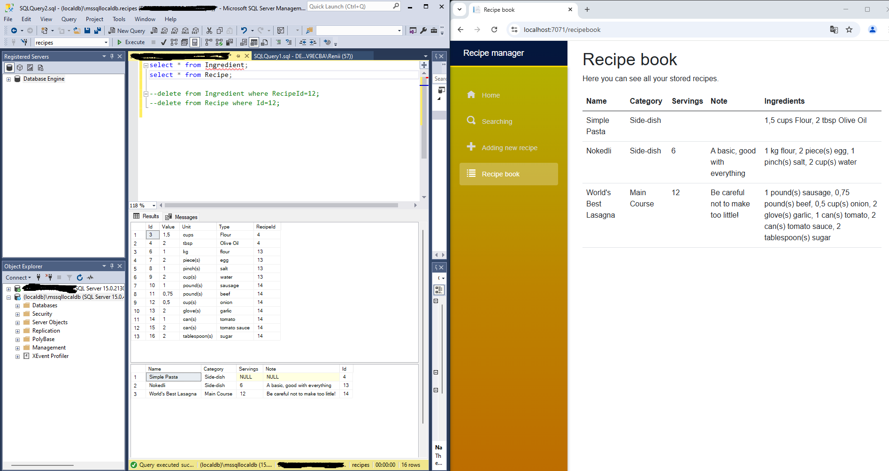

# My first Blazor project
to get myself more familiar with the features.

---
### Season 1:

The Recipe App provides opportunity the store, add and edit recipes. Also you can search for the wished ingredients or other property.

### Season 2:
A following main page can be find in the final program as well. The options are Details, Edit, and Delete which could be reached by the buttons.

